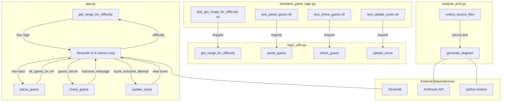

# Architecture Diagram

_Auto-generated by `analyze_arch.py`. Do not edit manually._

The codebase is a Streamlit number-guessing game with a deliberately buggy main application (`app.py`) and a refactored pure-logic module (`logic_utils.py`). The `app.py` file contains both the game logic functions and the Streamlit UI/game loop, which manages session state for the secret number, attempts, score, and history. The `logic_utils.py` module mirrors the four core functions (`get_range_for_difficulty`, `parse_guess`, `check_guess`, `update_score`) with corrected logic, and is the sole import target for the test suite. The test file (`tests/test_game_logic.py`) contains 29 unit tests covering all four functions in `logic_utils.py`. A separate utility script (`analyze_arch.py`) reads all project source files and calls the Anthropic API to auto-generate this architecture diagram.
